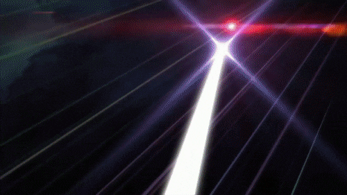

**One for All** distills 5 heterogeneous teacher LLMs (Qwen2.5-1.5B, SmolLM2-1.7B, Phi-3.5-mini, gemma-2-2b-it, MiniCPM-2B) into a single Qwen2.5-0.5B student via gated CKA geometry distillation (Path B — geometry-only, tokenizer-agnostic).

### Tabs

- **∀ Almas** — 3D UMAP soul space of all 6 models over 24 probe texts. Type a prompt to run the student live on ZeroGPU and see where it lands in the embedding space.
- **⬡ Geometria** — CKA alignment heatmap across all model pairs.
- **↗ Treino** — Loss curves and gate evolution over training steps.
